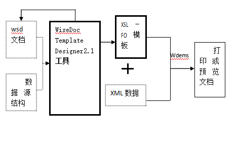
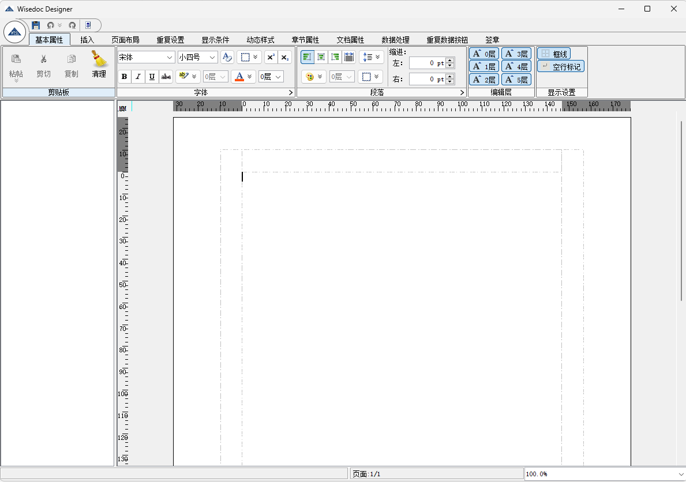

# wdtd

#### 介绍
WiseDoc Template Designer缩写wdtd是智能证单模版设计工具。是一个支持动态数据内容，高精度，高一致性，可视化的证单模板设计工具。

WiseDoc Template Designer致力于印刷类排版需求（如各类凭证，公文类证单，以及书籍，杂志类的排版），并支持动态文本数据内容，解决了巨量数据的自动排版问题，可只设计一份样式文档而应用到多份数据内容，如：只设计一份简历的样式文档，而张三，李四等的简历内容都可以使用这份相同的样式文档进行打印显示输出。由于这种样式文档可以对应于多份数据文档，因此样式文档定义为样式模板文档。同时，一份数据也可以使用多份模板，从而可以达到一份数据，多份显示打印效果的目的。

高精度包括：版式元素的各排版效果的精确控制，如排版位置，大小，颜色值等的精确控制。  

高一致性包括：

1. 平台统一（不同打印或显示设备上结果的排版结果一致）。
2. 样式设计界面与最终生成的结果打印或显示文档的一致。

## 系统应用体系结构

  
体系结构说明：

系统可接收的输入为：wsd文档（即模板文档），数据源结构。图中这两个输入用虚框标识表示该两个输入为非必须。如果没有源wsd文档作为输入，用户可在新建的空白模板文档基础上开始排版设计。用户也可以不指定数据源结构，此时表示所有的排版内容都是静态的数据，即此时的系统功能将等同于静态排版软件的功能。

系统输出为：wsd文档。

- 官网地址：[https://www.wisii.com](https://www.wisii.com)
- 文档地址：[https://www.wisii.com/doc/#/wdtd](https://www.wisii.com/doc/#/wdtd)
- 打包好的产品下载地址：[https://www.wisii.com/wp-content/download/designer.zip](https://www.wisii.com/wp-content/download/designer.zip)


#### 使用说明

```xml
	mvn clean install
```
启动:com.wisii.wisedoc.Main.java

主界面显示如下图：


#### 参与贡献

1.  Fork 本仓库
2.  新建 Feat_xxx 分支
3.  提交代码
4.  新建 Pull Request


#### 社区交流

- QQ群：579148691